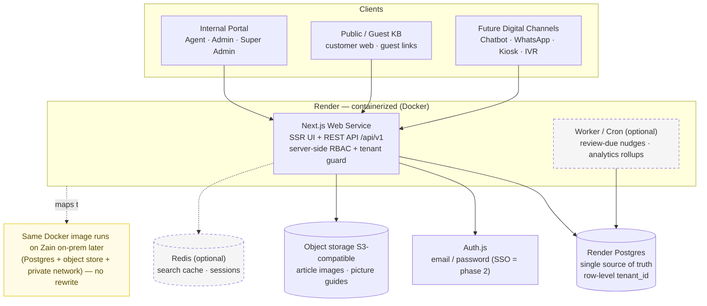
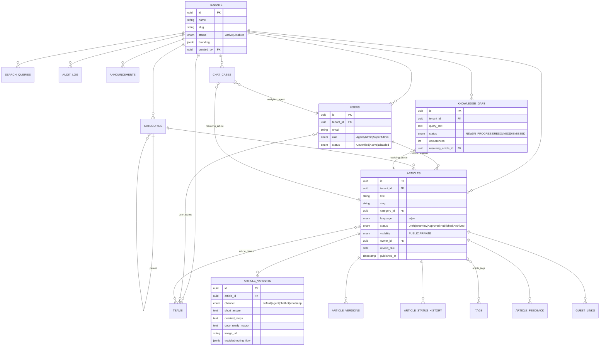
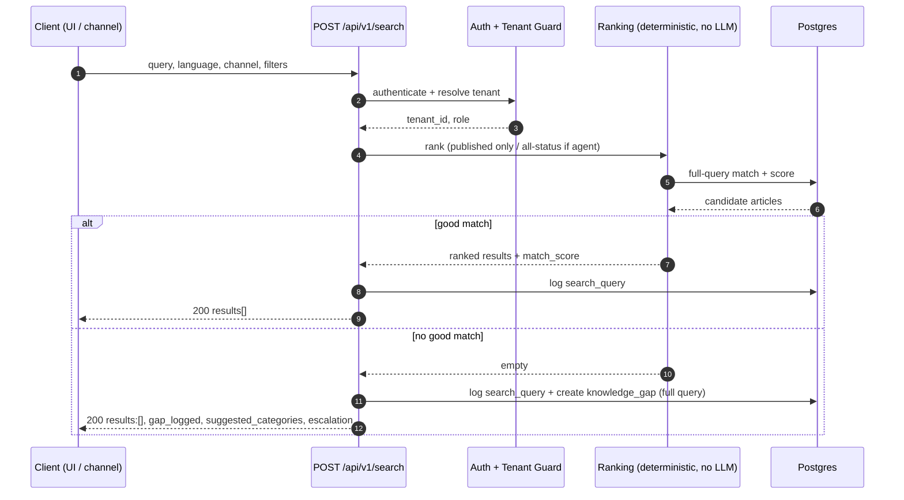
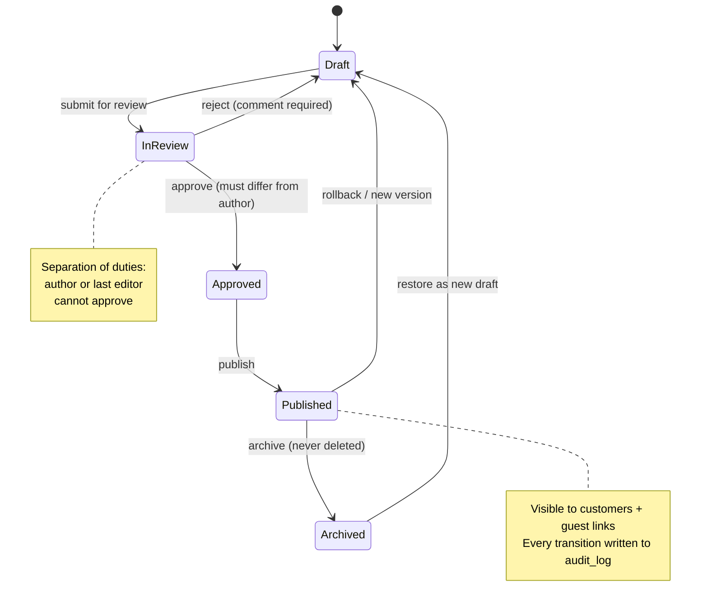
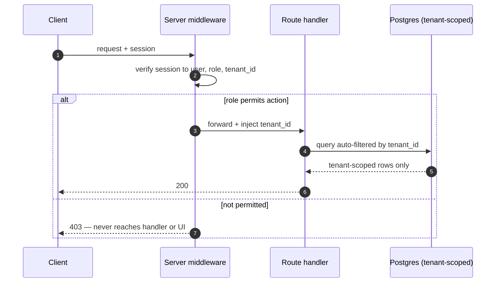
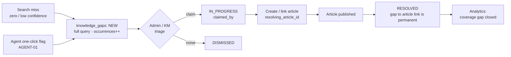
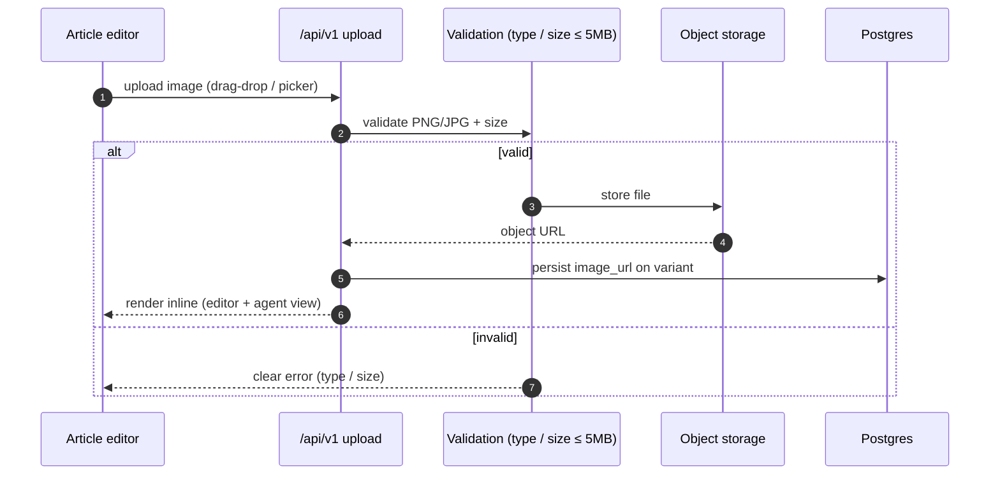

# Zain Iraq Knowledge Base — Engineering Blueprint

**System architecture · Database schema · API contracts · Process & user flows · Epics & build sequence**
*Phase 1 — 3-day greenfield build (Mon–Wed) · Hosted on Render · Bilingual Arabic / English*
*Version 1.0 — team onboarding edition. Supersedes the earlier build blueprint.*

---

## 0. How to use this document

This is the single onboarding reference for the team building Phase 1. Read it top to bottom once before you pick up a task. It tells you **what** we are building, **how** the system is shaped (architecture + schema + APIs), **why** each decision was made, and **who** does **what** in the 3-day window.

It consolidates four prior inputs into one place: the original RFP, the PRD (personas/stories/flows/permissions), the Solutions-Architect R&D plan (the two-API design), and the client's latest demo feedback. Where this document and an older one disagree, **this document wins** for Phase 1.

All diagrams are authored in Mermaid. The Markdown version embeds the editable Mermaid source so you can change a diagram in a pull request; the PDF embeds the same diagrams rendered to images. The schema is expressed as a Prisma-style data dictionary so it maps directly to `schema.prisma`.

---

## 1. Product & the rules of the game

**The product in one line:** an enterprise Knowledge Base for Zain Iraq that lets agents and customers find accurate answers fast, lets the content team author and govern that knowledge with a real approval trail, and improves itself by capturing the questions it cannot yet answer.

**Hard constraints for Phase 1**

| Constraint | What it forces in the build |
|---|---|
| 3 days, Mon–Wed | Build **all P0 and P1 stories**; P2 is phased (Appendix A). |
| Hosted on **Render**, built from scratch | Containerized service + managed Postgres. Greenfield — nothing carried over from the demo. |
| On-prem-ready, **no cloud AI** (client hard line) | Search is **deterministic** (keyword + relevance + confidence score). **No LLM, no RAG, no vector search this phase.** Nothing in the stack may depend on a cloud-only AI service. |
| "Testable" = Super Admin logs in, creates accounts, and **all users see the same accurate state** as they keep using it | Mandates a **real database + real auth + server-enforced RBAC**. No mock or browser-local state for anything a second user must see. |
| Bilingual **Arabic + English**; Kurdish parked | Two languages. Arabic authored first-class with correct RTL and inline bidi for Latin terms (4G, WiFi, product names). |

**Scope contract.** The client's latest demo feedback is the authority for Phase 1. Anything in the RFP / PRD / SA plan that the feedback did not reinforce is backlog, sequenced behind it. The feedback, restated: picture guides (top priority), multi-org isolation, team-level article visibility, learning module (design only — last), notifications (banners/tickers/broadcasts), dashboard (recent articles, top queries, favourites, language/department dropdowns), search filters (date range, author), AI search confirmed working as-is, Kurdish parked, must stay on-prem with no cloud AI.

**Definition of done for Phase 1.** The Super Admin can **set up organizations (Zain + OODI)** and provision every role into an org; each role can complete its core flows; content moves through a real Draft → Published gate with a full audit trail; search returns ranked results and recovers gracefully on a no-match; organization data stays isolated; and every count and state is consistent across users and across every screen that shows it.

---

## 2. System architecture

### 2.1 Stack decision

| Layer | Choice | Why |
|---|---|---|
| App | **Next.js (App Router)** as a single Render **web service**, SSR UI + `/api/v1` REST | One deployable we can ship in 3 days; the API routes double as the canonical channel API. |
| Packaging | **Docker** image | The same image runs on Render now and on Zain on-prem later — the core of the on-prem-portability promise. |
| DB | **Render Postgres** (managed) + **Prisma** ORM | One source of truth; Prisma's schema file *is* our schema doc and handles migrations + tenant scoping. |
| Auth | **Auth.js** (email / password), sessions | Sufficient for testing; SSO is Phase 2. |
| File / image storage | **S3-compatible object storage** (R2 / S3; MinIO on-prem) | Required for picture guides; survives multi-instance scaling (a Render disk would not — see 2.6). |
| Cache (optional) | **Redis** (Render) | Search-result caching + sessions if time allows; not on the critical path. |
| Worker (optional) | **Render cron / background worker** | Review-due nudges, analytics rollups. Thin / phase-aware. |

The alternative (separate React frontend + standalone NestJS API) gives a harder UI/API boundary but is two deployables to wire — defer that split to Phase 2 if the API needs to scale independently of the UI.

### 2.2 Architecture diagram



### 2.3 Component responsibilities

| Component | Owns |
|---|---|
| Next.js web service | UI rendering, `/api/v1` endpoints, auth/session, RBAC + tenant enforcement, search ranking, file-upload handling. |
| Postgres | All persistent state: tenants, users, content, versions, gaps, feedback, search logs, audit. |
| Object storage | Binary assets (article images for picture guides). DB stores only the URL. |
| Auth.js | Credential verification, session issuance. |
| Worker / cron | Out-of-band jobs (review-due reminders, analytics aggregation). Optional in Phase 1. |

### 2.4 Multi-tenancy strategy (single highest-leverage decision)

Single database, single schema, **row-level isolation by `tenant_id`** on every table. The Super Admin can **create and manage organizations (tenants) in-app** — both Zain and OODI exist in Phase 1 — and isolation between them is enforced so one platform serves multiple orgs with no data crossover.

- Every table carries `tenant_id`. Every query is scoped by it.
- Each user belongs to exactly one organization, selected by the Super Admin **at account creation** (see F-15 / F-17).
- Enforcement lives in a **Prisma client extension / middleware** that injects the `tenant_id` filter on every read and stamps it on every write — so isolation is provable by code review, not merely hidden by the UI.
- Recommended hardening (Phase 1 if time, else early Phase 2): **Postgres Row-Level Security (RLS)** as defense-in-depth, so even a missed application-layer filter cannot leak cross-tenant rows.
- Advanced per-organization settings (branding, per-domain workflow defaults) remain Phase 2; org creation, isolation, and per-org account provisioning are Phase 1.

### 2.5 Deployment & environments on Render

| Concern | Approach |
|---|---|
| Build / deploy | Dockerfile → Render web service; auto-deploy on push to `main`; PR preview environments. |
| Secrets / config | Render **Env Group** for `DATABASE_URL`, auth secret, object-storage credentials. Nothing secret in the repo. |
| Migrations | `prisma migrate deploy` runs as the release/build step on every deploy. |
| TLS | Render-managed HTTPS (free). |
| Health | `GET /api/v1/health` endpoint for Render health checks + uptime monitoring. |
| Scaling | Increase web-service instance count horizontally; **this is why images go to object storage, not a disk** (see 2.6). |

### 2.6 Image / file storage — a decision to ratify

Picture guides (the client's #1 priority) require image upload. Two options on Render: a **persistent disk** attached to the service, or **S3-compatible object storage**.

**Recommendation: object storage.** A Render disk is bound to a single instance, so the moment the web service scales to more than one instance, uploaded images become unavailable on the other instances. Object storage is instance-independent, and for on-prem later it maps cleanly to **MinIO** (S3-compatible, self-hosted) — same code, same API. This keeps the picture-guide feature correct under scale *and* portable to on-prem.

---

## 3. Database schema

### 3.1 Entity-relationship diagram



### 3.2 Schema conventions

- **`tenant_id` on every table.** No exceptions, including join tables.
- **UUID primary keys** everywhere; `created_at` / `updated_at` timestamps on every table.
- **Never hard-delete content.** Articles use an `Archived` status; the Super Admin is the only role with a true hard-delete path, and even that writes an audit entry.
- **`audit_log` is append-only.** No role (including Super Admin) may update or delete rows — enforced via DB grants.

### 3.3 Data dictionary

**Identity & org**

| Table | Key columns | Notes |
|---|---|---|
| `tenants` | `id`, `name`, `slug`, `branding (jsonb)`, `status`, `created_by`, `created_at` | **Organizations, created & managed by the Super Admin in-app.** Phase 1 seeds Zain and OODI. |
| `teams` | `id`, `tenant_id`, `name` | Lines of business for private-article scoping. |
| `users` | `id`, `tenant_id`, `name`, `email`, `password_hash`, `role`, `status`, `created_at`, `updated_at` | `UNIQUE(tenant_id, email)`. Role enum: Agent / Admin / SuperAdmin. |
| `user_teams` | `user_id`, `team_id`, `tenant_id` | M:N agent ↔ team membership. |

**Content**

| Table | Key columns | Notes |
|---|---|---|
| `categories` | `id`, `tenant_id`, `name`, `slug`, `parent_id` | Hierarchical (self-FK). `UNIQUE(tenant_id, slug)`. |
| `tags` | `id`, `tenant_id`, `name` | |
| `articles` | `id`, `tenant_id`, `title`, `slug`, `category_id`, `language`, `status`, `visibility`, `owner_id`, `author_id`, `current_version_id`, `review_due`, `created_at`, `updated_at`, `published_at` | The spine. `visibility` PUBLIC/PRIVATE; PRIVATE scoped via `article_teams`. |
| `article_tags` | `article_id`, `tag_id`, `tenant_id` | M:N. |
| `article_teams` | `article_id`, `team_id`, `tenant_id` | Private-article scoping (which teams can see it). |
| `article_variants` | `id`, `article_id`, `channel`, `short_answer`, `detailed_steps`, `copy_ready_macro`, `image_url`, `video_link`, `troubleshooting_flow (jsonb)`, `updated_at` | Channel-specific content. `channel=default` is the fallback. Satisfies structured-content-models + channel-variant requirements. |
| `article_versions` | `id`, `article_id`, `version_no`, `body`, `editor_id`, `created_at` | Snapshots for rollback/audit. Phase 1 versions the base body; per-variant versioning is Phase 2. |
| `article_status_history` | `id`, `article_id`, `from_status`, `to_status`, `actor_id`, `comment`, `created_at` | Workflow trail; powers separation-of-duties evidence and rejection comments. |

**Discovery, feedback & sharing**

| Table | Key columns | Notes |
|---|---|---|
| `knowledge_gaps` | `id`, `tenant_id`, `query_text`, `language`, `channel`, `status`, `occurrences`, `reported_by`, `claimed_by`, `resolving_article_id`, `created_at`, `updated_at` | `query_text` is the **full** query (never fragments). Cannot reach RESOLVED without `resolving_article_id`. |
| `article_feedback` | `id`, `tenant_id`, `article_id`, `helpful (bool)`, `channel`, `comment`, `session_ref`, `created_at` | "Was this helpful?" Yes/No, timestamped. |
| `guest_links` | `id`, `tenant_id`, `article_id`, `token (unique)`, `channel`, `created_by`, `revoked (bool)`, `created_at` | Public view-only links; only generatable for Published articles. |
| `search_queries` | `id`, `tenant_id`, `query_text`, `language`, `channel`, `user_id`, `results_count`, `top_match_score`, `created_at` | **Analytics backbone** — the single source for total searches, top queries, search failures, and time-window widgets. |

**Operations**

| Table | Key columns | Notes |
|---|---|---|
| `chat_cases` | `id`, `tenant_id`, `customer_name`, `subject`, `query_text`, `status`, `priority`, `assigned_agent_id`, `context (jsonb)`, `resolving_article_id`, `wait_started_at`, `resolved_at` | Agent queue + **Resolve Case carries context** (the `context` jsonb is the fix for the contextless-resolve defect). Seeded for the demo; live chat integration is Phase 2. |
| `announcements` | `id`, `tenant_id`, `title`, `body`, `type (banner/ticker/broadcast)`, `audience (all/team)`, `team_id`, `active`, `starts_at`, `ends_at`, `created_by`, `created_at` | Notifications (thin). |
| `audit_log` | `id`, `tenant_id`, `actor_id`, `action`, `target_type`, `target_id`, `target_label`, `before (jsonb)`, `after (jsonb)`, `created_at` | Append-only. `target_label` makes entries human-readable ("Article Published: SIM Lock Guide"). |

### 3.4 Key indexes & constraints

- `tenant_id` indexed on every table; composite `(tenant_id, status)` on `articles`, `(tenant_id, created_at)` on `search_queries` (time-window analytics), `(tenant_id, status)` on `knowledge_gaps`.
- `UNIQUE(tenant_id, email)` on `users`; `UNIQUE(tenant_id, slug)` on `articles` and `categories`; `UNIQUE(token)` on `guest_links`.
- FK constraints on every relationship; `ON DELETE` set to restrict for content (we archive, not delete).
- `audit_log`: app DB role granted INSERT + SELECT only — no UPDATE/DELETE.

### 3.5 Enumerations

`user_role` = Agent | Admin | SuperAdmin · `article_status` = Draft | InReview | Approved | Published | Archived · `language` = ar | en · `visibility` = PUBLIC | PRIVATE · `gap_status` = NEW | IN_PROGRESS | RESOLVED | DISMISSED · `channel` = default | agent | chatbot | whatsapp · `announcement_type` = banner | ticker | broadcast · `case_status` = waiting | active | resolved | abandoned.

---

## 4. API-first contract (the two APIs)

### 4.1 Why API-first

The RFP makes the API the **single source of truth for every channel** — agent portal, customer web, chatbot, WhatsApp, kiosk, IVR all consume the same `/api/v1`. We build the UI on top of these same endpoints so there is never a second, divergent data path. The endpoints are deterministic and traceable (no LLM), which is exactly what makes the on-prem promise credible.

### 4.2 Search API

```
POST /api/v1/search
{ "query": "...", "language": "ar|en", "channel": "agent|customer|chatbot|whatsapp",
  "filters": { "date_range": {...}, "category": "...", "author": null, "status": "published" } }
```

Match found → `200` with `results[]` (each `article_id`, `title`, `category`, `match_score`, `status`, `language`) and `gap_logged:false`.

No good match → `200` with `results:[]`, `gap_logged:true`, `gap_id`, `suggested_categories` (derived from the query's own keywords — cheap, no semantic search), and an always-present `escalation` object. **A failed search is never a dead end.**

### 4.3 Response / Content API

```
GET /api/v1/articles/{id}/response?channel=agent
```

Returns the structured, channel-specific fields for that article (`short_answer`, `detailed_steps`, `troubleshooting_flow`, `copy_ready_macro`, `image_url`, `video_link`) plus the feedback endpoint. This is content **resolution**, not generation. A blank channel variant falls back to `default` — never a missing-content error.

### 4.4 Supporting endpoints

| Endpoint | Purpose |
|---|---|
| `POST /api/v1/feedback` | Record helpful/unhelpful against an article (closed-loop signal from any channel). |
| `POST /api/v1/escalate` | The escalation action returned on a failed search. |
| `POST /api/v1/gaps` | Log a knowledge gap (agent one-click flag, or system on search miss). |
| `POST /api/v1/orgs` &middot; `GET /api/v1/orgs` | Super Admin creates / lists **organizations (tenants)** — e.g. set up OODI. |
| `POST /api/v1/articles/{id}/guest-link` | Generate a guest link (Published only). |
| `GET /api/v1/health` | Liveness for Render health checks. |

### 4.5 Cross-cutting API rules

Versioned under `/api/v1`. Every call authenticated and tenant-scoped server-side. Public/customer-facing endpoints are **rate-limited** (RFP concurrency/latency requirement). Ship an **OpenAPI/Swagger** document as the contract for the digital-channel teams — it is a deliverable, not an afterthought.

---

## 5. Process & information flows

### 5.1 Search request lifecycle



### 5.2 Content publish workflow



### 5.3 RBAC request enforcement



### 5.4 Knowledge-gap closed loop



### 5.5 Picture-guide image upload



---

## 6. Personas & permissions

### 6.1 The four enforced roles

We enforce **four** role tiers in code. The SA's additional roles (Content Creator, Reviewer, Knowledge Manager) are real responsibilities, but in Phase 1 they are permission bundles and workflow states **inside the Administrator tier** — splittable later without re-architecting.

| Role | Who | Core capabilities | Hard limits |
|---|---|---|---|
| **Customer** (guest) | Unauthenticated public user | Search/browse **published** articles; open guest links; submit helpfulness feedback | No login, no internal content, no authoring |
| **Customer Support Agent** *(Frontline Agent)* | Frontline contact-centre agent | Read articles in **all** statuses (read-only); handle case queue; **flag a gap in one click**; follow troubleshooting flows; copy macros; own metrics | Cannot create/edit/approve/publish |
| **Administrator** | Content/ops team | Create/edit/delete articles; manage variants; run the approval workflow; resolve & link gaps; analytics & audit; generate guest links | Cannot hard-delete platform objects; cannot manage users/roles |
| **Super Admin** | Platform owner (IT/product) | All Admin powers **plus** create/manage **organizations (tenants)**; invite/manage/deactivate users (assigning each to an org); assign roles; hard-delete; full audit; integration/API console | — |

**Two governance rules baked in regardless of the tier simplification:** (1) **separation of duties** — the author or last substantive editor of an article can never approve it; (2) **open knowledge capture** — *any* agent can flag a gap in one click, never gated behind an author role.

### 6.2 Permissions matrix

| Feature | Customer | Agent | Admin | Super Admin |
|---|---|---|---|---|
| View Published articles / guest links | Yes | Yes | Yes | Yes |
| View unpublished (Draft/In Review/Approved) | No | View only | Yes | Yes |
| Search KB | Published only | All statuses | Yes | Yes |
| Submit helpfulness feedback | Yes | — | — | — |
| Create / edit / delete article | No | No | Yes | Yes |
| Submit for review | No | No | Yes | Yes |
| Approve / reject (no self-approve) | No | No | Yes | Yes |
| Publish | No | No | Yes | Yes |
| Manage channel variants | No | No | Yes | Yes |
| Generate guest link | No | No | Yes | Yes |
| View Knowledge Gaps queue | No | Create only | Yes | Yes |
| Resolve / link a gap | No | No | Yes | Yes |
| Agent dashboard / case queue | No | Yes | View only | View only |
| Resolve a case | No | Yes | No | No |
| Analytics dashboard | No | No | Yes | Yes |
| Export analytics / audit | No | No | Yes | Yes |
| View audit trail | No | No | View only | Full |
| Create / manage organizations (tenants) | No | No | No | Yes |
| Invite / manage users, assign roles, RBAC config | No | No | No | Yes |
| Hard-delete | No | No | No | Yes |

---

## 7. Epics → stories (the prioritized backlog)

Seven build epics (E1–E7) plus one design-only epic (E8). **Phase 1 now covers all P0 and P1 stories** — every "Build" row below — with only P2 deferred. Story IDs cross-reference the PRD (US-/FR-) and SA plan.

### E1 — Identity, Roles & Multi-Org Foundation
*Why: nothing is testable without enforced roles, real accounts, and tenant isolation. This is the literal first build.*

| ID | Story | Pri | Scope |
|---|---|---|---|
| E1-S1 | Super Admin invites a user, sets role + team, takes effect immediately (US-32) | P0 | Build |
| E1-S2 | Role permissions enforced by the system, not just described (US-33, FR-21) | P0 | Build |
| E1-S3 | Every record carries `tenant_id`; no cross-tenant query path (SUPER-01) | P0 | Build |
| E1-S4 | Role change re-scopes access on next action (FR-22) | P0 | Build |
| E1-S6 | Super Admin **creates & manages organizations (tenants)** and assigns each user to an org at creation — e.g. set up **OODI** (SUPER-01/02) | P0 | Build |
| E1-S5 | SSO against corporate credentials | P2 | Phase 2 |

### E2 — Knowledge Content Lifecycle
*Why: the heart of the KB. **Picture guides (direct image upload) are the client's #1.***

| ID | Story | Pri | Scope |
|---|---|---|---|
| E2-S1 | Create/edit/delete article: title, category, tags, language, body (US-15/16/17) | P0 | Build |
| E2-S2 | **Upload images directly** into an article, not just a URL (AUTH-03) | P0 | Build |
| E2-S3 | Draft → In Review → Approved → Published, no skipping (US-19, FR-10) | P0 | Build |
| E2-S4 | System blocks approving your own article (US-18, FR-11) | P0 | Build |
| E2-S5 | Every status change logged with rollback (US-30, ADM-04) | P0 | Build |
| E2-S6 | `owner` + `review_due` on every article (ADM-06) | P0 | Build (fields) |
| E2-S7 | Channel variants (Agent/Chatbot/WhatsApp) + visible fallback warning (US-20/21, FR-13/14) | P1 | Build (thin) |
| E2-S8 | Structured troubleshooting flows that always terminate (US-12, FR-20) | P1 | Build |
| E2-S9 | Reviewer diff view + inline section comments (REV-02/03) | P2 | Phase 2 |

### E3 — Search & Findability (the two APIs)
*Why: the SA's spine; the client confirmed it works. Deterministic — satisfies no-cloud-AI.*

| ID | Story | Pri | Scope |
|---|---|---|---|
| E3-S1 | Search the **full multi-word query**, ranked (US-10, FR-01) | P0 | Build |
| E3-S2 | Zero-result recovery: suggested categories + escalation (AGENT-02, FR-02) | P0 | Build |
| E3-S3 | Search + Response exposed as documented APIs with match score | P0 | Build |
| E3-S4 | Agent search across **all** statuses, read-only, labelled (US-09, FR-19) | P0 | Build |
| E3-S5 | Filters: date range, category, author *(client feedback)* | P1 | Build |
| E3-S6 | Real-time autocomplete / smart suggestions | P2 | Phase 2 |
| E3-S7 | Semantic / vector + RAG answers | — | Phase 2 (gated on on-prem LLM) |

### E4 — Agent Workspace (cases + capture)
*Why: KCS — capture while resolving. Fixes contextless Resolve Case; one-click flag is the highest-leverage idea.*

| ID | Story | Pri | Scope |
|---|---|---|---|
| E4-S1 | Agent dashboard: queue, today's searches, helpful rate (US-07, FR-17) | P1 | Build |
| E4-S2 | "Resolve Case" opens **with case context**, never blank (US-08, FR-18) | P0 | Build |
| E4-S3 | **One-click gap flag**, captured as one full query (AGENT-01, US-11, FR-15) | P0 | Build |
| E4-S4 | Copy-ready macros, paste without reformatting | P1 | Build (thin) |
| E4-S5 | Agent view shows only agent-relevant nav (least privilege) (US-14) | P0 | Build |
| E4-S6 | Own performance metrics over time (US-13) | P2 | Phase 2 |

### E5 — Customer / Guest Experience
*Why: the self-service hub. Guest links + helpfulness feedback. Fixes dead links.*

| ID | Story | Pri | Scope |
|---|---|---|---|
| E5-S1 | Search/browse **published** articles, no login (US-01/02) | P0 | Build |
| E5-S2 | Open an article from a shared guest link, view-only (US-03, FR-06) | P0 | Build |
| E5-S3 | Every Read Article / category / banner link opens real content (US-05/06, FR-03) | P0 | Build |
| E5-S4 | Mark helpful/not-helpful; stored + timestamped (US-04, FR-08) | P0 | Build |
| E5-S5 | Admin generates a guest link with copy confirmation (US-24, FR-07) | P1 | Build |
| E5-S6 | "What's New" links to real releases (US-05) | P1 | Build (thin) |

### E6 — Knowledge-Gap Loop & Analytics
*Why: makes the KB self-improving and fixes the "bogus numbers / mock data" credibility gap.*

| ID | Story | Pri | Scope |
|---|---|---|---|
| E6-S1 | Gaps queue: each gap a **full readable query**, NEW/IN_PROGRESS/RESOLVED (US-22, FR-15/16) | P0 | Build |
| E6-S2 | Link gap → resolving article; can't resolve without a link (US-23, FR-16) | P0 | Build |
| E6-S3 | Analytics totals **match across every screen** (US-25/26, FR-26) | P0 | Build |
| E6-S4 | Metrics with no data source labelled "pending integration," never faked (US-35, FR-28) | P0 | Build |
| E6-S5 | Time-window widgets show only data in that literal window (US-28, FR-27) | P1 | Build |
| E6-S6 | Export analytics/audit as PDF **and** CSV/Excel (US-29, FR-29) | P1 | Build |
| E6-S7 | "Confidence" score explained where shown (US-31, FR-30) | P2 | Build (label) |
| E6-S8 | KM value metrics + manual pin/demote of results (KM-05/06) | P2 | Phase 2 |

### E7 — Notifications & Announcements (thin)
*Why: named in client feedback, visual, cheap.*

| ID | Story | Pri | Scope |
|---|---|---|---|
| E7-S1 | Admin pushes an announcement → banner/ticker to agents, all or by team | P1 | Build (thin) |
| E7-S2 | Configurable email notifications on KB events | P2 | Phase 2 |
| E7-S3 | Full multi-channel framework (pop-ups + bars + banners, per-user rules) | P2 | Phase 2 |

### E8 — Learning Module / Agent Assessments — **DESIGN ONLY (Phase 2, lowest priority)**
*Named in feedback but large and under-specified. Deliverable now is a wireframe + a phase/timeline. Do not let it enter the build — it is the single biggest threat to the 3-day window.*

---

## 8. User flows (per story)

Each in-scope story is covered by a documented flow. Infrastructure stories (e.g., E1-S3 `tenant_id`) are covered by §2–§5 rather than a user flow.

### 8.1 Story → flow coverage map

| Flow | Persona | Covers stories |
|---|---|---|
| F-01 Search the KB | Customer | E5-S1, E3-S1, E3-S2 |
| F-02 Browse by category/tag | Customer | E5-S1, E2-S1 (counts) |
| F-03 View shared guest article | Customer | E5-S2, E5-S3 |
| F-04 Submit feedback | Customer | E5-S4 |
| F-05 Handle queue & resolve case | Agent | E4-S1, E4-S2, E4-S5 |
| F-06 Search & discover during a case | Agent | E3-S4, E3-S1 |
| F-07 Log a knowledge gap | Agent | E4-S3, E6-S1 |
| F-08 Follow a troubleshooting flow | Agent | E2-S8 |
| F-09 Create & edit an article | Admin | E2-S1, E2-S2, E2-S6 |
| F-10 Submit, review, approve | Admin | E2-S3, E2-S4, E2-S5 |
| F-11 Manage channel variants | Admin | E2-S7 |
| F-12 Resolve a gap into an article | Admin | E6-S2, E6-S1 |
| F-13 Generate & share a guest link | Admin | E5-S5 |
| F-14 Review analytics & export | Admin | E6-S3..S7 |
| F-15 Manage users & roles | Super Admin | E1-S1, E1-S2, E1-S4 |
| F-16 Review audit trail | Super Admin | E2-S5, E6 (audit) |
| F-17 Set up & manage organizations | Super Admin | E1-S6 |

### 8.2 Flow catalogue

Each flow: **trigger → actor → preconditions → steps (user action / system response) → decisions → success.** Short where the happy path is obvious; the PRD holds exhaustive alternate-path detail.

**F-01 Search the KB** — *Customer · home search bar · no precondition.* Type a free-text query → submit → system evaluates the **whole** query (not per-keystroke) and returns ranked published results (title, category, snippet) → open a result (F-03). *Decision:* no match → suggested categories + escalation, and the query is logged as a gap candidate. *Success:* relevant content found for normal multi-word queries; misses captured.

**F-02 Browse by category/tag** — *Customer.* View featured categories (each with an accurate published count) → pick a category/tag (combinable filters) → open an article. *Rule:* counts are computed from one source and identical everywhere shown. *Success:* every category and link leads to real content; counts match across screens.

**F-03 View shared guest article** — *Customer · guest link · article must be Published.* Open the URL → read in a public, read-only "guest" layout (title, category, last-updated, body) in the channel-appropriate variant → optionally rate (F-04). *Decision:* article since unpublished → friendly "no longer available," not a raw 404. *Success:* full, correctly formatted content with no login.

**F-04 Submit feedback** — *Customer · article loaded.* See "Was this helpful? Yes/No" → choose → response stored + timestamped against the article → brief acknowledgement; "No" offers a next step. *Success:* every published/guest view collects a signal that rolls into analytics.

**F-05 Handle queue & resolve case** — *Agent · logged in · cases waiting.* View queue (customer, subject, status, wait; urgent sorted up) → open a case **with the customer's conversation/context attached** → search/attach an article → respond → mark resolved (removed from queue, resolution time recorded). *Decision:* no article fits → log a gap (F-07) without losing context. *Success:* every case opens with context and resolves or escalates.

**F-06 Search & discover during a case** — *Agent.* Enter a query → results across **all** statuses (read-only), non-published clearly labelled → open one in the agent variant. *Rule:* read-only — agents never edit/approve here. *Success:* the best existing answer (published or not) surfaces during a live case.

**F-07 Log a knowledge gap** — *Agent · from a no-results / low-confidence state.* One-click "Log gap" → system pre-fills the **complete original query** as one entry → confirm → saved NEW with timestamp + reporter → appears in the Admin queue. *Decision:* duplicate query → increment occurrences rather than create near-duplicates. *Success:* every gap is a complete, readable query an Admin can act on.

**F-08 Follow a troubleshooting flow** — *Agent · a flow exists.* Open Troubleshooting → pick an issue → follow branch prompts → reach a resolution or escalation step. *Rule:* every branch terminates (resolve or escalate) — no dead ends. *Success:* any published flow completes to a defined outcome.

**F-09 Create & edit an article** — *Admin.* New/Edit → editor (title, category, tags, language, body) → save as Draft (timestamped); upload images inline (F maps to 5.5); optionally delete with confirmation. *Rule:* title, category, body, language required even for Draft. *Success:* full authoring without developer/DB help.

**F-10 Submit, review, approve** — *Admin · Draft exists.* Submit (Draft → In Review) → a **different** Admin reviews → approve (In Review → Approved) or reject (back to Draft, comment required) → publish (Approved → Published). *Rules:* author ≠ approver; no skipping statuses; every transition audited. *Success:* nothing publishes without independent sign-off, fully attributable.

**F-11 Manage channel variants** — *Admin · base article exists.* Open Channel Variants → author Agent/Chatbot/WhatsApp versions independently → a channel with no variant falls back to default **with a visible warning to the managing Admin**. *Success:* every channel serves dedicated content or a clearly flagged fallback.

**F-12 Resolve a gap into an article** — *Admin · gap NEW/IN_PROGRESS.* Open a gap → mark In Progress (records who/when) → create or select the resolving article → mark Resolved → permanent gap↔article link stored. *Rule:* cannot resolve without a linked article. *Success:* every resolved gap is traceable to its fix.

**F-13 Generate & share a guest link** — *Admin · article Published.* Click Guest Link → URL generated + copied with on-screen confirmation → share. *Rule:* action only available for Published articles. *Success:* a confirmed, working public URL every time.

**F-14 Review analytics & export** — *Admin.* Pick a range (7/30/90D) → all metrics recompute for that exact range → totals match the agent dashboard and gaps page → export PDF or CSV/Excel. *Rules:* cross-page totals identical; time-window widgets literal; unsourced metrics labelled pending. *Success:* internally consistent figures, exportable.

**F-15 Manage users & roles** — *Super Admin.* Invite (name, email, **organization**, role, team) → the Super Admin **selects the organization** the user belongs to (Zain or OODI) and may create a new org inline (see F-17) → user accepts + sets password (Unverified → Active) → change a role → **access updates on the user's next action**, not just the label. *Rules:* every user belongs to exactly one org; an Agent never retains Admin access after demotion; a user only ever sees their own org's data. *Success:* every account's real access and org scope match what was assigned.

**F-16 Review audit trail** — *Super Admin.* Open Audit Trail → events in reverse-chron with actor, action, target, timestamp → filter by type/user/date → open an entry for before/after detail. *Rule:* every entry names the specific object affected. *Success:* any change traces to an actor, action, and time.

**F-17 Set up & manage organizations (tenants)** — *Super Admin · surfaced during account creation and in Org Management.* Open Organizations (or "Add organization" inline while creating an account) → enter the org name (e.g., **OODI**) → system creates the tenant with its own isolated users, content, categories, and analytics → assign the new account to that org. *Rules:* org creation is Super-Admin-only; a new org starts empty and fully isolated (no cross-org data); advanced per-org settings (branding, workflow defaults) are Phase 2. *Success:* the Super Admin can stand up OODI and provision accounts into it, separate from Zain.

---

## 9. Build sequence & team parcelling

### 9.1 Critical path

Land these **first** — every other epic consumes them:
1. Repo + Docker + Render services (web + Postgres) + env group + auto-deploy + `/health`.
2. Full Prisma schema + initial migration (all tables, `tenant_id`, enums).
3. Auth + the four-role RBAC + tenant-scoping middleware.
4. `/api/v1` skeleton with the two endpoints wired to the DB + the object-storage upload path.

### 9.2 Three parallel tracks (after foundations)

- **Track A — Content & Governance:** E2 (editor, picture guides, workflow, audit, variants).
- **Track B — Search & Surfaces:** E3 (search/response, filters, zero-result recovery) + E5 (customer/guest, feedback, guest links).
- **Track C — Agent & Loop:** E4 (dashboard, Resolve-with-context, one-click flag) + E6 (gap queue, gap→article, analytics consistency).
- **E7 notifications** is independent — slot into any slack.

### 9.3 3-day build checklist (P0 + P1)

Tick each item as it lands — this is the live tracker. Phase 1 scope is **all P0 + all P1** (P2 is out, Appendix A). Each day closes on its gate.

#### Day 1 — Mon · Foundations (all hands)

- [ ] Repo + Dockerfile + Render web service & Postgres provisioned
- [ ] Env group (`DATABASE_URL`, auth secret, object-storage creds)
- [ ] Auto-deploy on `main` + PR previews + `GET /api/v1/health`
- [ ] Full Prisma schema (all tables, `tenant_id`, enums) + initial migration
- [ ] Auth.js email/password + sessions
- [ ] Four-role RBAC + tenant-scoping middleware (server-side)
- [ ] **Organizations (tenants) management — Super Admin can create an org (Zain + OODI)**
- [ ] **Account creation includes org selection (assign each user to Zain or OODI)**
- [ ] `/api/v1` skeleton: search + response endpoints wired to DB
- [ ] Object-storage bucket + upload endpoint
- [ ] Seed Super Admin

> **Day 1 gate:** log in as Super Admin → set up the OODI org → create an Agent under a chosen org → that Agent cannot reach any Admin route and sees only its org's data; no cross-tenant query path.

#### Day 2 — Tue · Core build (parallel tracks)

**Track A — Content & Governance**

- [ ] Article CRUD (title, category, tags, language, body)
- [ ] Direct image upload (picture guides) with inline render
- [ ] Workflow Draft → In Review → Approved → Published (no skipping)
- [ ] Separation of duties enforced (author ≠ approver)
- [ ] Status history + `audit_log` writes on every transition
- [ ] `owner` + `review_due` fields
- [ ] Channel variants (Agent/Chatbot/WhatsApp) + visible fallback warning · *P1*
- [ ] Structured troubleshooting flows that always terminate · *P1*

**Track B — Search & Surfaces**

- [ ] Full-query ranking + match score (no per-keystroke)
- [ ] Zero-result recovery (suggested categories + escalation) + gap creation
- [ ] Response/Content API (channel fields + default fallback)
- [ ] Agent all-status search (read-only, non-published labelled)
- [ ] Search filters: date range, category, author · *P1*
- [ ] Public/guest article views + guest links + helpfulness feedback
- [ ] Every Read Article / category / banner link resolves (no dead ends)
- [ ] "What's New" links to real releases · *P1*

**Track C — Agent & Loop**

- [ ] Agent dashboard: queue, today's searches, helpful rate · *P1*
- [ ] Resolve Case opens with seeded case context (never blank)
- [ ] One-click gap flag captured as one full query
- [ ] Copy-ready macros (paste without reformatting) · *P1*
- [ ] Gaps queue NEW/IN_PROGRESS/RESOLVED + gap → article link
- [ ] Agent-only navigation (least privilege)

> **Day 2 gate:** full author → publish → search → find loop works end to end; a search miss and an agent flag both produce a complete-query gap an Admin can close.

#### Day 3 — Wed · Consistency, analytics, polish, seed, QA, rehearsal

- [ ] Analytics dashboard with totals **consistent across every screen**
- [ ] Time-window widgets show only data in that literal window · *P1*
- [ ] Export analytics/audit as **PDF + CSV/Excel** · *P1*
- [ ] Notifications banner/ticker (Admin → agents, all or by team) · *P1*
- [ ] Audit-trail screen + rollback
- [ ] Super Admin **user-management + org-management UI** (invite, immediate role change, create/assign OODI)
- [ ] RTL/Arabic + English seed content (incl. a picture guide + a channel-variant example)
- [ ] Seed accounts across **Zain and OODI** (2 Admins + 2 Agents on Zain; ≥1 Admin + Agent on OODI; customers)
- [ ] Seed `chat_cases` + `knowledge_gaps`
- [ ] End-to-end smoke test across all roles **and across both orgs (isolation)**
- [ ] Fix issues → demo rehearsal → share credentials

> **Day 3 gate:** Super Admin can create accounts that all users experience as one consistent, accurate shared state; OODI and Zain stay isolated; every total matches across screens. Demo-ready.

### 9.4 Definition of Done per epic (acceptance gates)

- **E1:** logging in as Super Admin, you can **set up the OODI org**, create an Agent under a chosen org who provably cannot reach any Admin route or another org's data; a role change takes effect on the next request; no query returns another tenant's rows.
- **E2:** an article with an uploaded image goes Draft → Published only after a *different* admin approves; the audit trail shows each transition with who/when; rollback restores a prior version as a new Draft.
- **E3:** a multi-word query returns ranked results; a no-match returns suggested categories + escalation and creates one full-query gap; agents see all-status results labelled.
- **E4:** Resolve Case always opens with context; one click logs a complete-query gap into the Admin queue.
- **E5:** a guest link opens a published article with no login; every home-page link resolves; helpful/not-helpful is stored.
- **E6:** total searches / articles / gaps are identical on the agent dashboard, the gaps page, and analytics; a gap cannot be resolved without a linked article; no widget shows fabricated numbers.
- **E7:** an admin announcement appears to agents as a banner/ticker.

---

## 10. Non-functional requirements & hardening

| Area | Requirement | Phase-1 approach |
|---|---|---|
| Security | Hashed passwords; server-side RBAC; encrypted at rest/in transit; input validation; upload type/size checks (≤5MB PNG/JPG); rate-limited public API; append-only audit | Argon2/bcrypt; Auth.js sessions; Render TLS + encrypted Postgres; Zod validation; DB grants for audit immutability |
| Performance | Low-latency search/retrieval; guaranteed response under concurrent load | Indexed queries; optional Redis cache; load-check the search endpoint before demo |
| Scalability | Handle growing content/users/searches | Horizontal web-service scaling on Render; object storage (not disk) so scale-out is safe |
| Availability | 99.9% target with SLA | Render health checks + uptime monitor; document the SLA mapping for the client |
| Localization | Arabic + English, full RTL, inline bidi for Latin terms | Arabic authored first-class (not translated-after); bidi rendering verified in seed content |
| Observability | Traceable issues | Render logs + structured request logging; error tracking (e.g., Sentry) optional |

---

## 11. Seed & test-data strategy (this is what makes it *testable*)

The client's definition of testable — Super Admin creates accounts, all users see the same accurate state — is satisfied only with a real DB and credible seed data. Before the demo:

- **Organizations:** seed **two orgs — Zain and OODI** — both created through the Super Admin org-setup flow, to demonstrate multi-org isolation and per-org account provisioning.
- **Accounts:** the demo Super Admin (`Salman@zain.com`); **two Administrators** (so separation-of-duties is demonstrable — one authors, one approves) and **two Agents** under **Zain**, plus at least one Admin + Agent under **OODI** to prove cross-org isolation; a couple of Customers. No mock/placeholder names anywhere in production views.
- **Content:** a dozen articles seeded in **both Arabic and English**, across several categories, with RTL verified and at least one picture guide and one channel-variant example.
- **Operations:** a few seeded `chat_cases` (so Resolve Case has real context) and a few `knowledge_gaps` (so the gap → article loop can be demoed end to end).
- **Smoke test (run across roles before rehearsal):** Super Admin **sets up the OODI org and provisions an account under it** → Super Admin creates an Agent under Zain → Agent logs in, searches, flags a gap, cannot reach Admin, **sees only Zain data** → Admin sees the gap, authors an article with an image, submits → second Admin approves and publishes → Customer opens it via guest link and rates it → analytics totals match on all three screens → **the OODI account sees none of Zain's content**. If that loop is green, the demo is green.

---

## 12. Risk register (3-day window)

| Risk | Impact | Mitigation |
|---|---|---|
| Learning module creeps into scope | Blows the timeline | Hard "design only" line; confirmed with client; lowest priority |
| Image storage chosen as Render disk | Images vanish under scale-out | Use S3-compatible object storage (decision 2.6) |
| RBAC stays cosmetic (UI-only) | Fails the core "enforced roles" requirement | Server-side middleware + tenant scoping on day 1; DoD gate E1 |
| Inconsistent numbers across screens | Repeats the demo's credibility problem | Single analytics source (`search_queries`/`articles`/`gaps`); DoD gate E6 |
| Search relevance feels weak on Arabic | Poor demo impression | Tune ranking + seed quality Arabic content; verify RTL/bidi early |
| Separation-of-duties not demoable | Can't show the approval gate | Seed two Admin accounts from the start |
| `tenant_id` retrofitted late | Full re-architecture | In the schema from migration #1 (decision 2.4) |
| Two live orgs (Zain + OODI) leak across each other | Compliance failure | Enforce `tenant_id` in middleware; smoke-test isolation across both orgs (§11) |
| P0 **and** P1 both in 3 days — aggressive scope | Timeline risk | Protect the Day-1 critical path; sequence P1 after each track's P0; reduce depth (never correctness) on thin items if pressed |
| Demo data thin / placeholder | Looks unfinished | Seed strategy in §11 owned and done before Wednesday |

---

## Appendix A — Explicitly out of Phase 1

| Item | Why deferred | Phase |
|---|---|---|
| Kurdish search/display | Client parked it | Later |
| Advanced per-organization settings (branding, per-domain workflow defaults) | Org creation, isolation & per-org accounts are **Phase 1**; deeper per-domain config isn't a 3-day item | Phase 2 |
| Semantic/vector + RAG answers | On-prem LLM unresolved; current search works | Phase 2 |
| SSO | Email/password suffices for testing | Phase 2 |
| Contact-centre integrations (Sprinklr/AVAYA/Genesys), IVR, call recording | API-ready now; connectors later | Phase 2+ |
| Review diff, inline comments, SLA reassignment, weekly digests | Governance polish | Phase 2 |
| Learning module / assessments | Large, under-specified | Phase 2 (design only now) |

Use this list with the client verbatim — "here is the phase and the timeline," never "we can't."

## Appendix B — Glossary

**KCS** Knowledge-Centred Service — capture knowledge as a by-product of resolving cases. **Knowledge gap** a query with no good answer, logged for content follow-up. **Channel variant** a channel-specific version of an article's content sharing one article ID. **Separation of duties** author ≠ approver. **Tenant** an isolated organisation (Zain now, Oodi later) sharing one platform.
